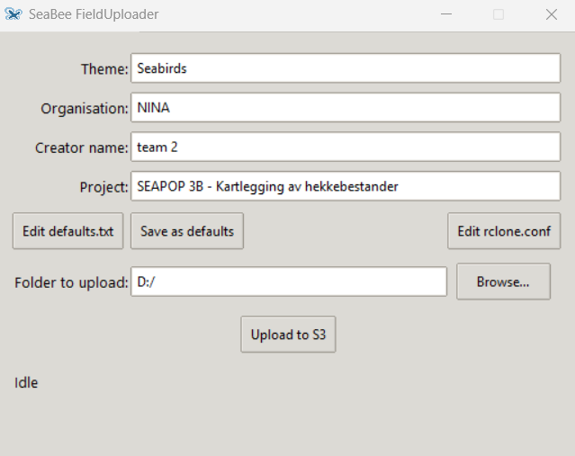

# SeaBee FieldUploader

Tkinter GUI for uploading field data to MinIO/S3 via rclone. Fully portable — no admin rights needed.

## Quick start

### Windows

1. Download [main.zip](https://github.com/SeaBee-no/SeaBee-FieldUploader/archive/refs/heads/main.zip) or clone this repository.
2. Double-click **`setup.bat`**. It downloads a portable Python and rclone into `runtime/`.
3. Edit **`configs\rclone.conf`** with your S3 credentials.
4. Double-click **`run.bat`** to launch the app.

#### Desktop shortcut (Windows)

1. Right-click Desktop → **New** → **Shortcut**
2. Location: browse to `run.bat`
3. Name it `SeaBee FieldUploader`
4. Right-click → **Properties** → **Change Icon…** → point to `app\seabee.ico`

### Linux / macOS

```bash
git clone https://github.com/SeaBee-no/SeaBee-FieldUploader.git
cd SeaBee-FieldUploader
chmod +x setup.sh run.sh
./setup.sh
# Edit configs/rclone.conf with your S3 credentials
./run.sh
```

If your system Python already has tkinter, `setup.sh` creates a lightweight venv. If tkinter is missing (or Python is not installed), it downloads a portable Python build that includes everything.

## Usage

1. Plug in the hard drive and the SD card.
2. Copy **everything** from the SD card's `DCIM` folder to the **root** of the hard drive.
	 - No need to create folders or rearrange anything.
	 - Example end state:

		 ```
		 D:/
		 ├── DJI_202505121518_003_Revlingen_MT
		 ├── DJI_202505261112_001_Create-Area-Route12
		 ├── DJI_202505261314_002_FleinvaerFroya
		 ├── DJI_202505271307_003_Kjoeroeya
		 ├── DJI_202505271307_004_Create-Area-Route13
		 ├── DJI_202505271502_005_Enholmen
		 ├── fielduploader_upload_20260322184312
		 ├── fielduploader_upload_20260323175654
		 ├── DJI_0043.JPG
		 ├── DJI_0044.JPG
		 ├── DJI_0045.JPG
		 └── DJI_0046.JPG
		 ```

3. If you have images/files directly in the root (like `DJI_0043.JPG` above), leave them there.
	- The app will move these into a timestamped folder before upload: `fielduploader_upload_YYYYMMDDHHMMSS`.
4. In the app, select the hard drive root (e.g. `D:/`) as the upload location.
5. Start the upload and wait.
	- If the upload fails or stops, restart it and choose the same upload location again.




## What setup does

| Step | Windows (`setup.bat`) | Linux/Mac (`setup.sh`) |
|------|-----------------------|------------------------|
| Python | Downloads [embedded Python 3.12](https://www.python.org/downloads/) into `runtime/python/` | Uses system Python + venv, or downloads [python-build-standalone](https://github.com/indygreg/python-build-standalone) |
| Packages | Installs PyYAML via pip | Same |
| Rclone | Downloads [rclone](https://rclone.org/) into `runtime/rclone/` | Same (or uses system rclone if on PATH) |
| Configs | Copies templates from `resources/` into `configs/` | Same |

Everything lives inside the repo folder. Nothing is installed system-wide.


## Config files

All config files are in the `configs/` folder next to the app.

| File | Purpose |
|------|---------|
| `rclone.conf` | S3/MinIO credentials. **You must edit this.** |
| `defaults.txt` | Default values for theme, organisation, creator, project. |
| `bucket.conf` | Upload target: `REMOTE_NAME`, `BUCKET_NAME`, `OBJECT_PREFIX`. Leave alone unless you know what you are doing. |

The GUI has an **"Open config folder"** button that opens `configs/` in your file manager.

## Debugging

For debugging or seeing console output, run directly instead of using `run.bat`:

```cmd
:: Windows
set PYTHONPATH=%cd%
runtime\python\python.exe -m app
```

```bash
# Linux/Mac
PYTHONPATH=. runtime/venv/bin/python3 -m app
```

Set `SEABEE_RCLONE_DEBUG=1` to see full rclone output.

A debug log is written to `configs/debug.log`.
